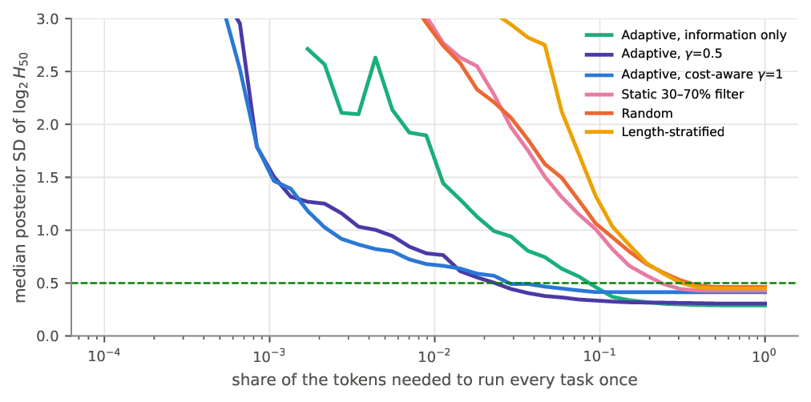
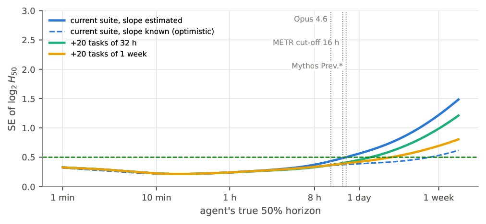
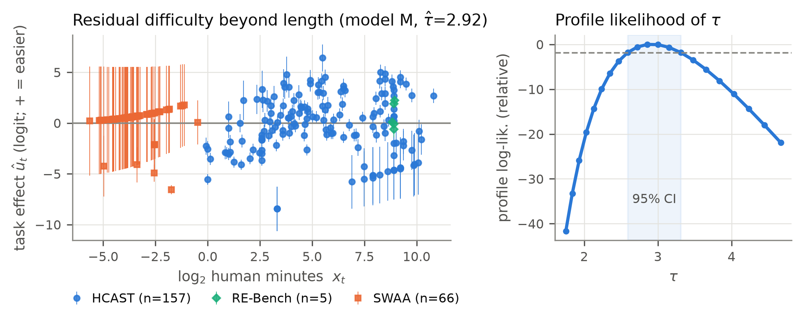
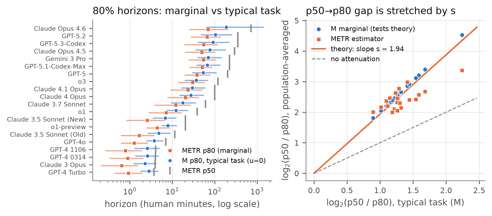

# horizon-irt

**An item-response analysis of METR's AI time horizons, and HorizonCAT: cost-aware adaptive measurement of frontier agents.**

[](https://kshitij-bhardwaj.github.io/horizon-irt/)
[](LICENSE)
[](requirements.txt)
[-eb6834)](https://github.com/METR/eval-analysis-public)

### ▶ [Open HorizonCAT, the interactive tool](https://kshitij-bhardwaj.github.io/horizon-irt/)

METR's **50% time horizon** summarises an AI agent's capability as the length of tasks, in human-expert minutes, that it completes half the time. Its roughly seven-month doubling time is a widely cited AI-safety indicator ([Kwa et al., 2025](https://arxiv.org/abs/2503.14499); [METR, 2026](https://metr.org/blog/2026-1-29-time-horizon-1-1/)).

This repository studies that estimator as a measurement problem, in three parts:

1. **Reproduce** METR's published horizons and doubling times from its public data, with METR's pipeline and with an independent re-implementation.
2. **Model** task difficulty beyond length with a nested family of item-response models, of which METR's model is an exact special case. Then test what changes.
3. **Build HorizonCAT.** It estimates a new agent's horizon from a few well-chosen tasks, weighs information against token cost, and says when the task suite can no longer measure an agent at all.

> Independent project. Not affiliated with or endorsed by METR. Every design decision, including the mistakes we made and corrected, is logged in [`study/DECISIONS.md`](study/DECISIONS.md) and [`prototype/DECISIONS_PROTOTYPE.md`](prototype/DECISIONS_PROTOTYPE.md).

---

## Highlights

**Reproduction.** METR's pipeline and our independent re-implementation agree to within 0.1 day on every doubling time. We traced a gap between METR's January 2026 figures and its current repository to an undocumented change of the logistic ridge penalty from 0.1 to 1e‑5. On identical data, that change alone moves Claude Opus 4.5 from 320 to 293 minutes. ([details](replication/VALIDATION.md))

**Difficulty beyond length.**
- A random task effect u_t ~ N(0, τ²) gives τ̂ = 2.92 logits (95% CI 2.59–3.31).
- Length explains about 80% of latent difficulty, matching [BRIDGE](https://arxiv.org/abs/2602.07267) and METR.
- The rest is large: a task one SD harder than its length predicts behaves like one about **5× longer**.

**Prediction.**
- On tasks other agents have attempted, the IRT model cuts log-loss by **38%** (AUROC 0.929 → 0.974). About 95% of that gain comes from knowing *which* task it is.
- On unseen task families it **ties** METR. We show METR's curve is already the correctly averaged predictor for new tasks.

**50% vs 80% horizons.**
- We prove the 50% horizon is unchanged by symmetric task heterogeneity; the 80% horizon is not.
- For a typical task, frontier agents reach 80% reliability at about ⅓ of their 50% horizon (GPT-5.2: 104 vs 304 min). METR's 80% figure implies ⅕ to ⅒.

**Per-agent horizons depend on the suite.**
- Simulation shows METR's per-agent horizons carry a suite-specific component of up to ±0.5 doublings (R² = 0.995), plus a downward bias at the frontier.
- The **doubling time survives**: the IRT-corrected value differs by +15 days (95% CI −6 to +36), which is not significant.

**Estimator stability.**
- We derive a closed-form "pivot" law for how METR's ridge penalty moves horizons.
- Shrinking slopes toward their common mean, instead of toward zero, cuts Claude Opus 4.6's confidence-interval width from 3.8 to 2.1 doublings without changing the trend.

**HorizonCAT.**
- Replaying 20 held-out agents' real runs, information-driven selection pins the horizon to ±0.5 doublings in **95%** of replays, with calibrated 95% intervals.
- It uses a median of **8% of the tokens** needed to run every task once, but this depends strongly on the agent: about 1% for GPT-4-era agents, versus **31–71% for frontier agents** (GPT-5 to Claude Opus 4.6). For those, only long, expensive tasks are informative.
- With the agent's slope treated as unknown, the current suite can measure horizons only up to about **17 hours**. This independently matches METR's own choice to exclude horizons above 16 hours from its trend.

<p align="center">
  
  
</p>
<p align="center"><sub><b>Left:</b> uncertainty vs token budget in the replay back-test. <b>Right:</b> the suite's measurable range, and how adding long tasks extends it.</sub></p>

<details>
<summary><b>More figures</b></summary>
<p align="center"></p>
<p align="center"></p>
</details>

---

## Repository layout

| Path | What it contains |
|---|---|
| [`replication/`](replication/) | Independent re-implementation of METR's estimator, runner for METR's own pipeline without DVC, [`VALIDATION.md`](replication/VALIDATION.md) |
| [`study/`](study/) | IRT model family (MAP and marginal maximum likelihood), experiments E1–E4, tests T1–T6, [`RESULTS.md`](study/RESULTS.md), [`DECISIONS.md`](study/DECISIONS.md) |
| [`prototype/`](prototype/) | HorizonCAT engine, replay back-test, frontier and suite-design analysis, page export, tests E1–E4, [`DECISIONS_PROTOTYPE.md`](prototype/DECISIONS_PROTOTYPE.md) |
| [`extend/`](extend/) | Command-line tool to evaluate **new** models adaptively from your own runs ([guide](extend/README.md)) |
| [`docs/`](docs/) | The GitHub Pages site (HorizonCAT in the browser) |
| [`scripts/setup.sh`](scripts/setup.sh) | Fetches METR's data at the pinned commit and creates the Python environment |

## Quick start

```bash
git clone https://github.com/kshitij-bhardwaj/horizon-irt.git && cd horizon-irt
scripts/setup.sh                      # fetches METR data @52cb829 into eval-analysis-public/, creates .venv
```

Run the tests:

```bash
(cd study && ../.venv/bin/python -m tests.test_models)
(cd prototype && ../.venv/bin/python -m tests.test_engine)
```

Reproduce METR's numbers, two ways:

```bash
replication/run_official.sh
.venv/bin/python replication/validate_horizon.py
```

Plan an evaluation of a new model (see [`extend/`](extend/)):

```bash
.venv/bin/python extend/horizoncat_cli.py plan --runs my_model_runs.jsonl --next 5
```

Full reproduction commands for every experiment are in [`study/README.md`](study/README.md) and [`prototype/README.md`](prototype/README.md). Everything runs on a laptop CPU (developed on an 8 GB Apple M1); the slowest step is a 35-minute bootstrap.

---

## Call for support

METR's public per-run data ends with **Claude Opus 4.6 and GPT-5.3-Codex**. METR publishes only headline numbers for GPT-5.4, Gemini 3.1 Pro and Claude Mythos Preview, and nothing yet for models such as GPT-5.6 Sol, GPT-6.1 Sol or Claude Opus 5.5. Our analysis also suggests those models are past the point where the current task suite can measure them. Extending this work needs help in four areas:

1. **Per-run results for newer models** on METR's task suite: per-task success counts are enough, no transcripts. From METR, from labs, or from anyone with research access to the tasks. → [Share run data](../../issues/new?template=share-run-data.md)
2. **API credits or compute** to run newer models on the tasks through [Inspect](https://github.com/UKGovernmentBEIS/inspect_ai). HorizonCAT reduces the cost, though least at the frontier: a median of 8% of the full suite in the replay, and 31–71% for frontier agents.
3. **Long tasks (32 hours to a week) with human baselines.** Per our design analysis, measuring a 48-hour horizon to ±0.5 doublings needs about **19 one-week tasks** or **41 tasks of 32 hours**; a one-week horizon needs about **48 one-week tasks**.
4. **Review and collaboration** from people in psychometrics and AI-evaluation methodology: model checks, better task-difficulty features, and budget-constrained adaptive designs.

→ [Offer support or collaborate](../../issues/new?template=collaborate.md) · [Contributing guide](CONTRIBUTING.md)

API keys must never be committed: use environment variables. Shared data must come with terms that allow sharing.

---

## Data and licensing

- **Code and our analysis outputs:** [MIT](LICENSE).
- **METR's evaluation data is not stored in this repository.** `scripts/setup.sh` fetches it from [METR/eval-analysis-public](https://github.com/METR/eval-analysis-public) at commit `52cb829`. The live page loads METR's public runs file directly from METR's repository when you open replay mode.
- The page's `docs/data.json` holds only this project's outputs: IRT parameters, task-level summary statistics, back-test and design results.
- METR's repository did not include an explicit licence at the time of writing. Please cite METR for any use of the data.

## Method notes and honesty

The decision logs record what we decided, why, and what we rejected, including errors we corrected:

- A design calculation that ignored slope uncertainty (P16).
- A coverage-metric bug that we first misdiagnosed as miscalibration (P18 → P20).
- A crash in the first version of the interactive page (P22).

Known limitations:
- Only 20 agents.
- Gaussian, length-independent task effects.
- One run per task in HorizonCAT.
- Token cost is a cross-agent median.
- The cost of hypothetical long tasks is extrapolated.

## Citation

If you use this work, please cite it together with the work it builds on:

```bibtex
@software{bhardwaj2026horizonirt,
  title  = {horizon-irt: An item-response analysis of AI time horizons and cost-aware adaptive measurement (HorizonCAT)},
  author = {Bhardwaj, Kshitij},
  year   = {2026},
  url    = {https://github.com/kshitij-bhardwaj/horizon-irt}
}
@misc{kwa2025measuring,
  title  = {Measuring {AI} Ability to Complete Long Tasks},
  author = {Kwa, Thomas and others},
  year   = {2025}, eprint = {2503.14499}, archivePrefix = {arXiv}
}
@misc{liu2026bridge,
  title  = {{BRIDGE}: Predicting Human Task Completion Time From Model Performance},
  author = {Liu, Fengyuan and Gala, Jay and Nilaksh and Bahdanau, Dzmitry and Reddy, Siva and Larochelle, Hugo},
  year   = {2026}, eprint = {2602.07267}, archivePrefix = {arXiv}
}
```

## Acknowledgements

- [METR](https://metr.org) for publishing its task-level run data and analysis code.
- The [BRIDGE](https://arxiv.org/abs/2602.07267) authors for the human-time anchoring that HorizonCAT builds on.
- The adaptive-testing literature it draws from: ATLAS, Fluid Benchmarking, tinyBenchmarks, and [Efficient Benchmarking of AI Agents](https://arxiv.org/abs/2603.23749).
- Developed with AI assistance (Claude Code). All results are reproducible from this repository.
